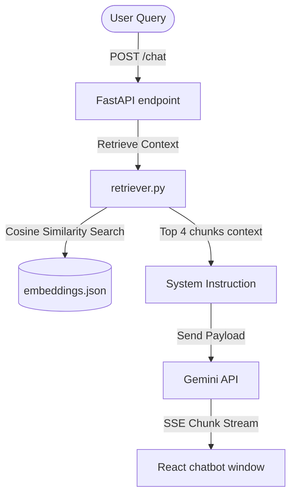

# Mukeshkumar Boominathan — Personal Portfolio & AI RAG Representative

A premium, award-winning developer portfolio site and AI Assistant RAG pipeline for **Mukeshkumar Boominathan** (Software Engineer, AI Engineer, and Full Stack Developer). 

Designed in the style of Stripe, Vercel, and Linear (dark-mode glassmorphism) and fully responsive.

## Project Structure

This project is structured as a two-package repository:
```
/frontend    --> Next.js (React) App Router, TS, Tailwind CSS v4, Framer Motion
/backend     --> FastAPI (Python), uv dependency lock, Gemini API static-RAG matcher
```

## Quick Start (Local Development)

### 1. Start the Backend (FastAPI)
Open a terminal in the `/backend` directory:
```bash
# Install uv and sync dependencies
python -m pip install uv
python -m uv sync

# Set up environment configuration (Get a key from https://aistudio.google.com/)
copy .env.example .env
# Edit .env and set GEMINI_API_KEY=your_key_here

# Precompute mock vectors so retriever starts up successfully in offline mode
python -m uv run app/rag/generate_mock_embeddings.py

# Run the backend API server
python -m uv run uvicorn app.main:app --reload --port 8000
```
*The API docs will be available at `http://localhost:8000/docs`.*

### 2. Start the Frontend (Next.js)
Open another terminal in the `/frontend` directory:
```bash
# Install dependencies
npm install

# Create local environment config
echo NEXT_PUBLIC_API_URL=http://localhost:8000 > .env.local

# Run Next.js server
npm run dev
```
*The portfolio page will be live at `http://localhost:3000`.*

---

## AI Assistant (HireMukesh AI) Flow



1. **Context Indexing**: Mukesh's resume facts, achievements (speech, script, adzap), and projects (LangGraph claim analyzer, CrewAI customer support, Netflix MERN) are segmented into 23 chunks.
2. **Offline Mode**: A local precomputation script embeds chunks using `text-embedding-004` (simulated via mock seeds for local testing without key).
3. **Similarity Retrieval**: When a recruiter posts a query (e.g., "Summarize his experience"), FastAPI gets the search query vector, performs cosine similarity calculations in Python, and retrieves the top 4 matched chunks.
4. **LLM Synthesis**: Matched chunks are injected into the Gemini prompt context. The AI generates a customized, evidence-supported stream response, showing referencing sources back to the client.

## Contact Information
- **Email**: mukeshkumarb107@gmail.com
- **Phone**: +91 8680834741
- **LinkedIn**: [linkedin.com/in/mukesh-kumar-b-b57122270](https://www.linkedin.com/in/mukesh-kumar-b-b57122270)
- **GitHub**: [github.com/MUKESH-KUMAR-BOOMINATHAN](https://github.com/MUKESH-KUMAR-BOOMINATHAN)

